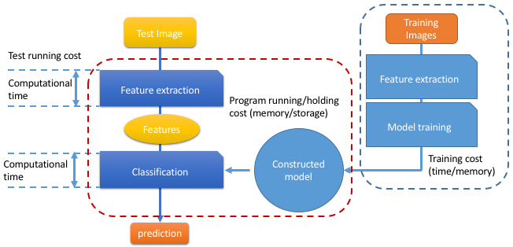

## STAT GU4243/GR5243 Spring 2020 Applied Data Science
### Project: Predictive analytics: model evaluation and selection

### -- for a facial emotion recognition task

In this project, we will carry out **model evaluation and selection** for predictive analytics on image data. As data scientists, we often need to **evaluate** different modeling/analysis strategies and decide what is the best. Such decisions need to be supported by sound evidence in the form of *model assessment, validation and comparison*. In addition, we also need to **communicate our decision and supporting evidence** clearly and convincingly in an accessible fashion.

#### Challenge
For this project, the data contains [a set of 2,500 facial images with 22 different emotions](https://drive.google.com/open?id=1K6KCo5fM-XfWbMamVQNuCSPUTBUuJ8nR)[require logged into Columbia LionMail in your browser]. Here is an alternative [data link](https://www.dropbox.com/s/kvi949ea1rey1d8/train_set.zip?dl=0). These two links lead to **identical** data. 

The project focuses on creating an mobile AI program that **accurately recognizes the emotion from facial images**. 

The portability of this AI program (holding storage and memory cost) and the computational efficiency (test running time cost) are of great concern to your client. This translates to a balance between the complexity of variable/features/models used and the predictive performance. 

